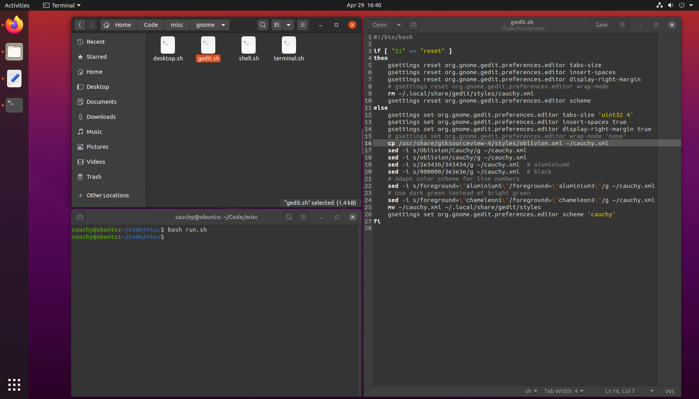
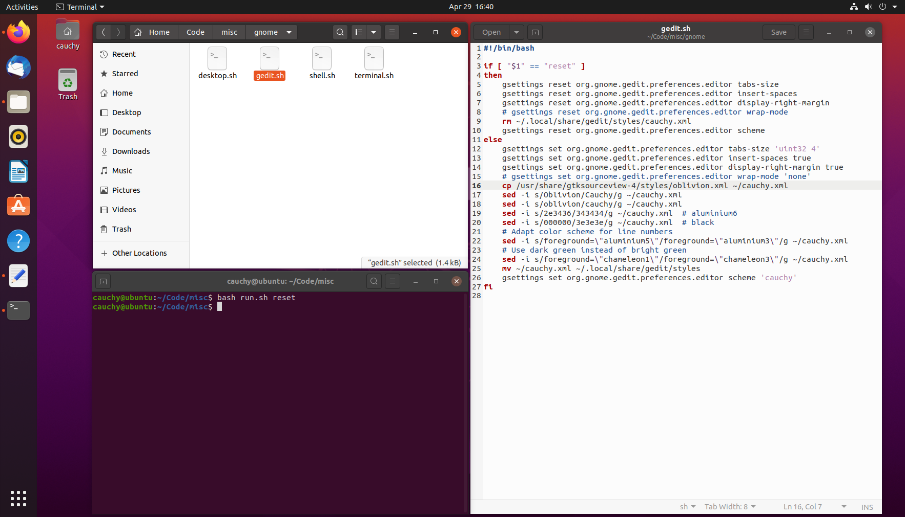

# ubuntu-tweaks

Collection of personal scripts, which I use after installing Ubuntu 20.04, to configure some built-in tools and adjust the appearance.

## Usage

Apply new configuration
```
bash run.sh
```

Restore default configuration (every configuration set above will be reverted to its default)
```
bash run.sh reset
```

## Details

I use the new ```Yaru-dark``` theme. For the terminal and the editor, I created a color scheme, which is based on the ```Tango``` colors, but uses the background colors of the ```Yaru-dark``` theme, similar to the ```Oblivion``` color scheme.

In addition, I removed the default desktop icons as well as some of the icons of the dock.

The following components are currently adapted (see ```gnome/``` Folder)
* Text Editor
* Terminal
* Desktop
* Shell

## Illustration

Adapted (executing ```bash run.sh```)


Default (preinstalled or executing ```bash run.sh reset```)

